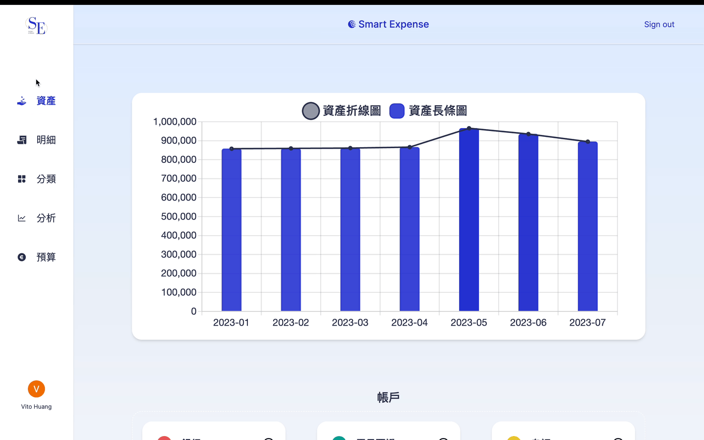
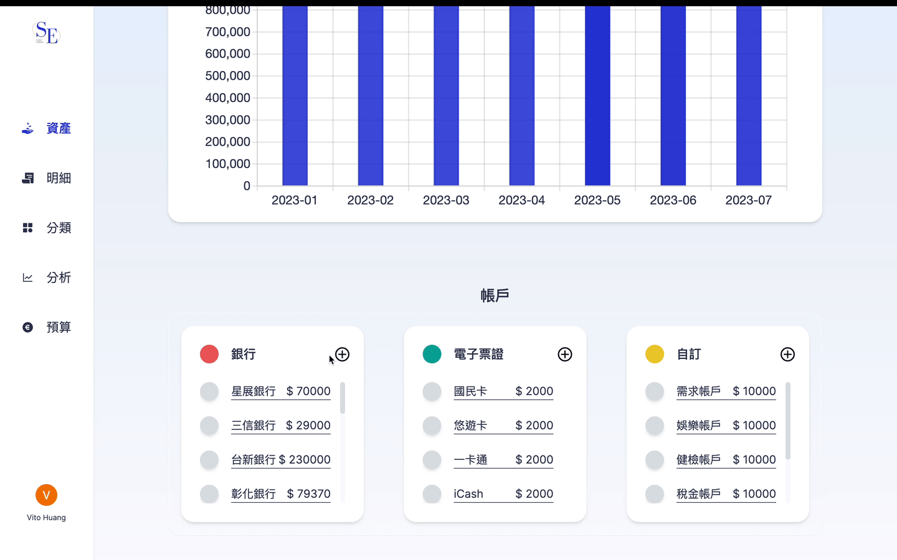
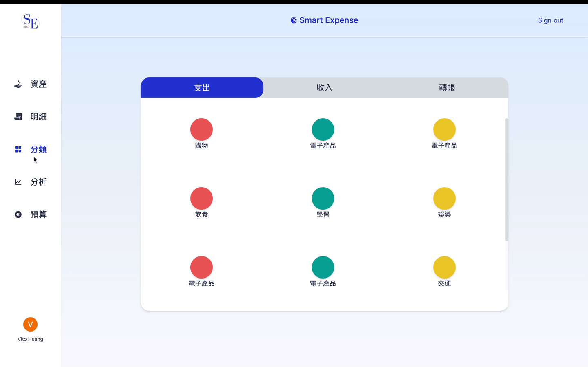
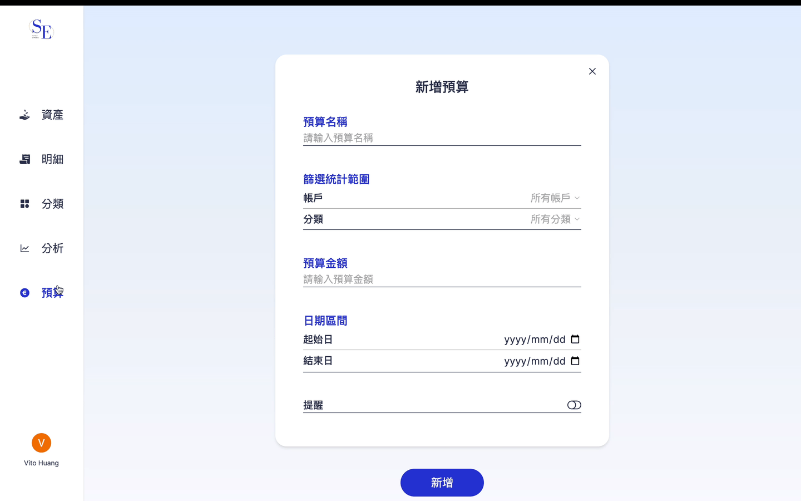
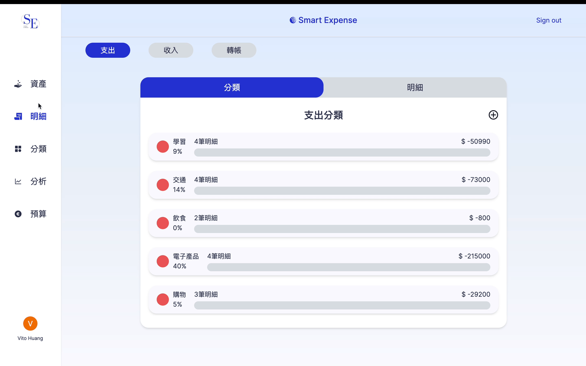
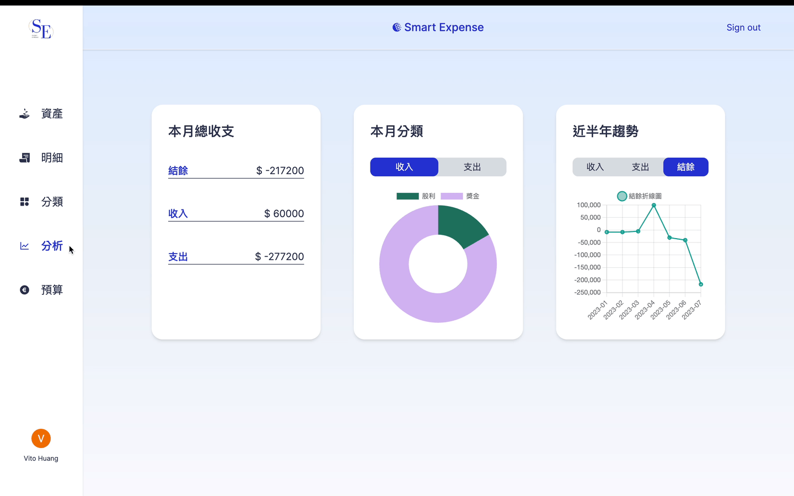

  

 

  

    <a href="https://github.com/VitoProgramming/smart-expense#About">About</a>
    |
    <a href="https://github.com/VitoProgramming/smart-expense#Demo">Demo</a>
    |
    <a href="https://github.com/VitoProgramming/smart-expense#Contact">Contact</a>
  

# Smart Expense

[Smart Expense](https://smart-expense.vercel.app/) is an expense tracker that helps users managing finances smoothly.

## Smart Expense

- Interactive Data Visualisation - Administered Chart.js, offered stunning charts to help users better understand the spending patterns, and gained priceless insights into financial habits as well as make data-driven decisions.
- Customisable Account / Category Management - Carried out Firebase to make user able to customise accounts and categories according to preferences.
- Seamless Receipt Checking - Improved seamless page transitions with Next.js Link component, enabling client-side navigation without full page reloads.
- Real-time Expense Tracking - Implemented real-time tracking utilising useState and useContext.
- Concise Balance Analysis - Displayed tidy and informative UI, improving comprehension of expensing trend.
- Efficient Budget Planning - Provided timely alerts and helped users stay within boundary limits by taking advantage of React-Toastify.

## Built with

      

**Base**

- Next.js
- TypeScript
- Chart.js
- Tailwind CSS
- Firestore
- ESLint
- Prettier

### Flow chart

### Demo

- Analyze property trends as well as manage accounts.
  

- Add and check the account balance.
  

- Create and review custom transaction categories.
  

- Set budgets for categories to manage spending.
  

- Upload and check receipts for expense tracking.
  

- Analyze financial data over the past half-year.
  

### Contact

  
  
